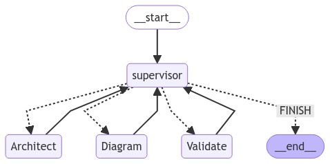

# AWS Architect Agent


AWS Architect Agent는 AWS 솔루션 설계를 자동화하고 시각화하는 대화형 AI 도구입니다. 사용자의 요구사항을 바탕으로 최적의 AWS 아키텍처를 설계하고, 이를 diagram-as-code YAML 형식으로 생성한 후 시각적 다이어그램으로 표현합니다.




## 주요 기능

이 프로젝트는 다음과 같은 주요 노드로 구성된 워크플로우를 통해 작동합니다:

1. **Supervisor 노드**: 
   - 전체 워크플로우를 관리하고 다음 실행할 노드를 결정합니다.
   - LLM을 사용하여 현재 상태를 평가하고 다음 작업(Architect, Diagram, Validate, 또는 FINISH)을 선택합니다.

2. **Architect 노드**: 
   - 사용자 요구사항을 바탕으로 AWS 아키텍처를 설계합니다.
   - 선택된 아키텍처를 diagram-as-code YAML 형식으로 생성합니다.
   - 생성된 YAML의 유효성을 검증합니다.

3. **Diagram 노드**: 
   - Architect 노드에서 생성한 YAML을 파싱하여 시각적 다이어그램을 생성합니다.
   - 생성된 다이어그램을 PNG 이미지 파일로 저장합니다.

4. **Validate 노드**: 
   - 생성된 다이어그램의 품질과 정확성을 검증합니다.
   - 다이어그램의 완전성과 아키텍처의 논리적 일관성을 검토합니다.
   - 필요한 경우 개선 사항을 제안합니다.

이 노드들은 Supervisor의 결정에 따라 순차적 또는 반복적으로 실행되어 최적의 AWS 아키텍처 설계를 도출합니다.

## 설치

1. 이 저장소를 클론합니다:
    ```bash
    git clone https://github.com/didhd/aws-architect-agent
    cd aws-architect-agent
    ```

2. 필요한 패키지를 설치합니다:
    ```bash
    pip install -r requirements.txt
    ```

3. AWS 자격 증명을 설정합니다.

## 사용법

1. `app.py`를 실행하여 Streamlit 앱을 시작합니다:
    ```bash
    streamlit run app.py
    ```

2. 웹 브라우저에서 Streamlit 앱에 접속하여 사용할 모델을 선택합니다.

3. AWS 아키텍처 요구사항을 입력하고 "아키텍처 생성" 버튼을 클릭합니다.

4. 에이전트가 YAML을 생성하고, 다이어그램으로 시각화한 후 검증 결과를 제공할 때까지 기다립니다.

## 예제

입력: "고가용성 웹 애플리케이션을 위한 AWS 아키텍처를 설계해주세요. 사용자 트래픽은 변동이 심하며, 데이터베이스와 정적 자산 저장소가 필요합니다."

출력: 
- YAML 형식의 AWS 아키텍처 설계
- 아키텍처 다이어그램 (PNG 이미지)
- 설계 검증 결과 및 개선 제안

## 기여

기여는 언제든지 환영합니다. 버그 수정이나 기능 추가를 원하시면, Pull Request를 제출해 주세요.

## 라이센스

이 프로젝트는 [MIT 라이센스](LICENSE)를 따릅니다.